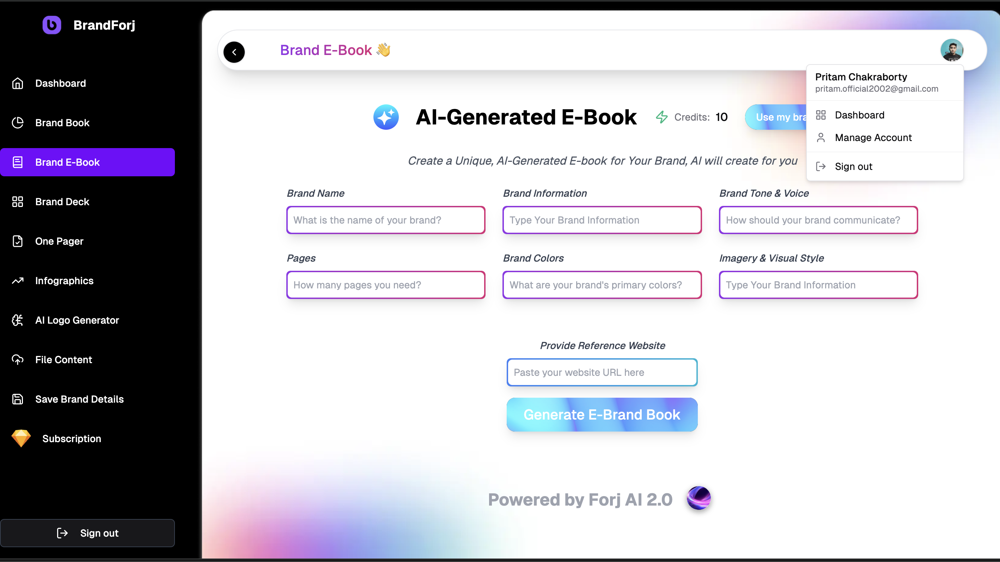
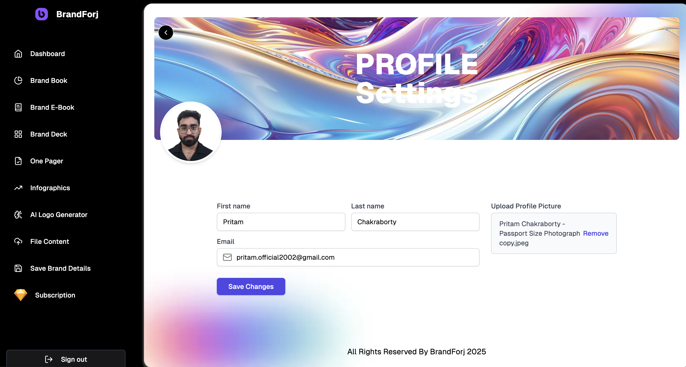

# BrandForJ - AI-Powered Brand Asset Generation Platform

BrandForJ is a sophisticated web application that helps businesses and individuals generate and manage their brand assets using AI technology. Built with modern web technologies, it offers a comprehensive suite of tools for brand identity creation and management.

## Application Screenshots

### Dashboard & Brand Asset Generation

*Main dashboard showcasing brand asset generation options and modern UI*

### Brand E-Book Generation Interface

*Intuitive interface for creating AI-powered brand e-books*

### Profile & Settings

*User profile management and account settings*

## Features

- **AI Logo Generation**: Create unique, professional logos using advanced AI algorithms
- **Brand Asset Creation**: Generate various brand assets including:
  - Brand Books
  - Brand Decks
  - eBooks
  - One-Pagers
  - Infographics
- **User Management**:
  - Secure authentication via Clerk
  - User profile management
  - Credit system for asset generation
- **Admin Panel**:
  - User management dashboard
  - Activity monitoring
  - System administration
- **Modern UI/UX**:
  - Responsive design
  - Dark/Light mode support

## Tech Stack

- **Frontend**:
  - Next.js 14
  - React
  - TypeScript
  - Tailwind CSS
  - shadcn/ui components
  - Radix UI primitives
  - Next Themes

- **Backend**:
  - Next.js API routes
  - Prisma ORM
  - PostgreSQL database
  - Gemini integration
  - Blackforest-lab/FLUX.1-dev model Implementation.
  - Cloudinary for image management

- **Authentication**:
  - Clerk Authentication

- **Other Tools**:
  - Chart.js for analytics
  - jsPDF for document generation
  - Zod for validation
  - Immer for state management

## Getting Started

1. Clone the repository:
   ```bash
   git clone https://github.com/toastmaster-Pritam/BrandForJ.git
   ```

2. Install dependencies:
   ```bash
   npm install
   ```

3. Set up environment variables:
   Create a `.env` file with the following variables:
   ```
   DATABASE_URL="your-postgresql-url"
   NEXT_PUBLIC_CLERK_PUBLISHABLE_KEY="your-clerk-publishable-key"
   CLERK_SECRET_KEY="your-clerk-secret-key"
   OPENAI_API_KEY="your-openai-api-key"
   CLOUDINARY_CLOUD_NAME="your-cloudinary-cloud-name"
   CLOUDINARY_API_KEY="your-cloudinary-api-key"
   CLOUDINARY_API_SECRET="your-cloudinary-api-secret"
   ```

4. Set up the database:
   ```bash
   npx prisma migrate dev
   ```

5. Run the development server:
   ```bash
   npm run dev
   ```

## Project Structure

- `/src/app` - Next.js pages and API routes
- `/src/components` - Reusable React components
- `/src/lib` - Utility functions and configurations
- `/prisma` - Database schema and migrations
- `/public` - Static assets
- `/src/hooks` - Custom React hooks
- `/src/schemas` - Zod validation schemas

## Features in Detail

### AI Logo Generation
The platform uses OpenAI's advanced algorithms to generate unique and professional logos based on user inputs and preferences.

### Brand Asset Generation
Comprehensive suite of tools for generating various brand assets:
- Brand Books: Detailed brand guidelines and specifications
- Brand Decks: Presentation-ready brand materials
- eBooks: Digital publications for brand storytelling
- One-Pagers: Concise brand summaries
- Infographics: Visual representation of brand data

### User Management
- Secure authentication using Clerk
- User profile management with customizable settings
- Credit system for managing asset generation usage

### Admin Panel
- Comprehensive dashboard for system administration
- User management and monitoring
- Activity tracking and analytics

## Contributing

We welcome contributions to BrandForJ! Please feel free to submit issues and pull requests.

## License

This project is licensed under the terms of the LICENSE file included in the repository.
